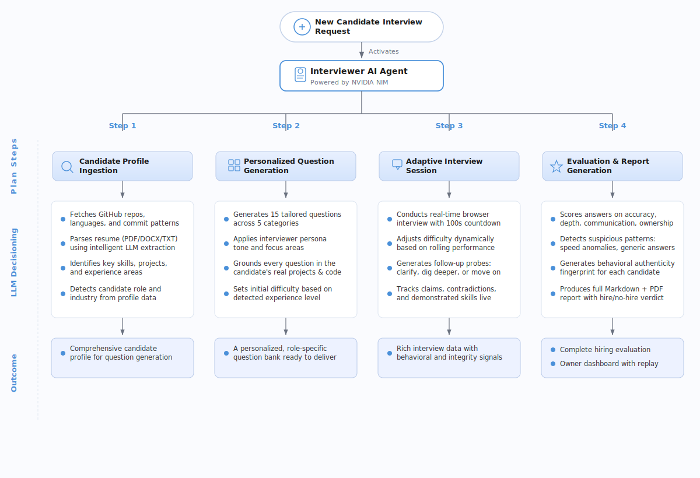

# Interviewer Agent

An AI-powered interview system that analyzes a candidate's GitHub profile or resume, conducts a personalized adaptive interview through a browser UI, and generates a full hiring evaluation report.

Most mock interview tools ask generic textbook questions. Interviewer Agent reads your actual code, commit history, resume, and project architecture — then builds every question around what you've really built.

## How It Works

<p align="center">
  
</p>

## What It Does

1. **Analyzes the candidate** — GitHub repos, languages, commit patterns, or parsed resume (PDF/DOCX/TXT)
2. **Generates 15 personalized questions** — experience, project, skill, situational, and curveball categories, all grounded in the candidate's real work
3. **Runs an adaptive browser-based interview** — 100-second countdown per question, follow-up probes, real-time feedback signals, voice input support
4. **Scores every answer** on four dimensions: accuracy, depth, communication, and ownership (1-10 each)
5. **Detects suspicious patterns** — flags impossibly fast answers, generic responses, and claims that contradict the candidate's profile
6. **Generates a full hiring report** — Markdown and PDF with scores, strengths, weaknesses, red flags, and a hire/no-hire recommendation

## Two-Role Access System

| Role | Access |
|------|--------|
| **Candidate** | Interview UI only — no scores, no reports, no evaluation data visible |
| **Owner** | Full dashboard — reports, replay, candidate comparison, model switching |

The owner portal is password-protected via `OWNER_PASSWORD` in `.env`.

## Interviewer Personas

| Persona | Style |
|---------|-------|
| **Technical Expert** | Deep domain knowledge, probes expertise hard, expects precise answers |
| **Senior Manager** | Focuses on leadership, ownership, impact, and results |
| **HR Screener** | Friendly but structured, soft skills and culture fit |
| **Executive Panel** | High pressure, multi-angle, covers everything |

Each persona shapes the question tone, follow-up behavior, and final evaluation.

## Quick Start

### Prerequisites

- Python 3.10+
- A [GitHub personal access token](https://github.com/settings/tokens) (read-only public access)
- An [NVIDIA NIM API key](https://build.nvidia.com/) for LLM inference

### Setup

```bash
# Clone the repo
git clone <your-repo-url>
cd interviewer-agent

# Create virtual environment
python -m venv venv
source venv/bin/activate  # On Windows: venv\Scripts\activate

# Install dependencies
pip install -r requirements.txt

# Configure environment
cp .env.example .env
# Edit .env and add your NVIDIA_API_KEY, GITHUB_TOKEN, and OWNER_PASSWORD
```

### Run

```bash
# Browser UI (recommended)
python run.py

# Terminal mode
python main.py

# Or pass a GitHub username directly
python main.py torvalds
```

The browser UI launches at `http://localhost:8000` with:
- `/` — Candidate interview interface
- `/owner` — Owner portal (login required)
- `/dashboard` — Candidate comparison dashboard
- `/replay/{session_id}` — Full interview replay

## Browser UI Features

- **Resume upload** (PDF, DOCX, TXT) or GitHub username input
- **Profile review** — confirm or edit detected role/industry before starting
- **Adaptive difficulty** — questions get harder or easier based on performance
- **Follow-up probes** — AI asks clarifying or deeper questions when warranted
- **Real-time feedback** — listening indicators, micro-acknowledgments, confidence meter
- **Voice input** — speak answers via Web Speech API
- **100-second countdown** — auto-submits when time runs out
- **Owner dashboard** — view reports, replay interviews, compare candidates, switch LLM models

## AI Backend

Powered by **NVIDIA NIM** via the OpenAI-compatible API. Default model: `meta/llama-3.3-70b-instruct`.

Models can be switched at runtime from the owner dashboard. Configuration is persisted in `data/model_config.json`.

## Output

After completing an interview, reports are saved to `outputs/`:

- **`username_timestamp.md`** — Full Markdown report
- **`username_timestamp.pdf`** — Formatted PDF report

Each report includes:
- Executive summary and hire/no-hire recommendation
- Score breakdown by dimension and category
- Strengths and weaknesses
- Integrity check and authenticity fingerprint
- Complete Q&A log with per-answer scores and feedback

## Project Structure

```
run.py                           Browser UI entry point
main.py                          Terminal mode entry point
src/
  llm_client.py                  NVIDIA NIM client (OpenAI-compatible)
  ingestion/
    github_fetcher.py            GitHub profile analysis
    resume_parser.py             PDF/DOCX/TXT resume parsing
  interview/
    personas.py                  Interviewer persona definitions
    question_generator.py        AI question generation + intro
    session.py                   Terminal interview UI
    adaptive.py                  Adaptive difficulty engine
    candidate_model.py           Cross-answer reasoning model
    followup.py                  Follow-up question generator
  evaluation/
    scorer.py                    Multi-dimension answer scoring
    cheat_detector.py            Integrity and anomaly detection
    fingerprint.py               Authenticity fingerprinting
  report/
    generator.py                 Markdown + PDF report generation
  web/
    app.py                       FastAPI backend
    models.py                    Request/response models
    session_store.py             SQLite-backed session management
    results_store.py             Persistent results storage
    static/
      index.html                 Candidate interview UI
      owner.html                 Owner portal
      dashboard.html             Comparison dashboard
      replay.html                Interview replay viewer
data/                            Candidate profiles + model config
outputs/                         Generated reports
```

## How Scoring Works

Each answer is evaluated on four dimensions:

| Dimension | What It Measures |
|-----------|-----------------|
| **Accuracy** | Is the answer technically correct? |
| **Depth** | Does it go beyond surface level with specifics and tradeoffs? |
| **Communication** | Is it clear, structured, and well-articulated? |
| **Ownership** | Does the candidate show genuine understanding vs. memorized content? |

The cheat detector independently flags:
- **Speed anomalies** — answers submitted faster than humanly possible
- **Generic responses** — answers that could apply to anyone
- **Profile contradictions** — claims that don't match GitHub/resume data

## License

MIT
